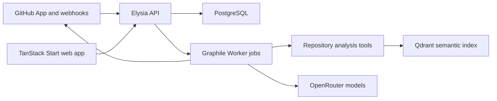

Scopy is split into a typed web/API product surface, a worker-backed GitHub integration, and a repository analysis toolkit used by the review agent.



## Main boundaries

| Area | Location | Responsibility |
| --- | --- | --- |
| Product app | `apps/web` | Authenticated UI for onboarding, repositories, pull requests, analytics, billing, and workspace settings. |
| API | `apps/api` | Elysia routes, Better Auth integration, Drizzle data access, GitHub integration, billing, and review orchestration. |
| Worker | `apps/api/src/worker.ts` | Graphile Worker process that handles webhook processing and pull request reviews. |
| Repository tools | `apps/tools` | Diff parsing, symbol inspection, file reading, text search, code chunking, and semantic search. |
| Shared UI | `packages/ui` | shadcn/ui components, global styles, and UI utilities. |
| Database | PostgreSQL | Auth, workspaces, repositories, pull requests, review runs, findings, billing, and worker jobs. |

## Request flow

The web app talks to the API through Eden treaty. The treaty client is typed from the exported Elysia app type, so route changes in `apps/api` flow into frontend TypeScript checks.

```ts
import type { App } from "api"
```

Authenticated product data should be loaded through React Query hooks. The existing hooks in `apps/web/src/hooks` are the preferred pattern for query keys, loading state, and treaty error handling.

## Review flow

At a high level:

1. GitHub sends an installation or pull request webhook to the API.
2. The API verifies and stores the webhook event.
3. A Graphile Worker job processes the event.
4. Pull request review jobs fetch PR files and repository context from GitHub.
5. `apps/tools` builds diff, symbol, file, text search, and semantic context for the agent.
6. The review model proposes findings.
7. The verifier model confirms candidate findings.
8. The API publishes a GitHub review comment and inline findings when possible.
9. Scopy review run, usage, billing, and debug metadata are persisted.

## Data model

The Drizzle schema in `apps/api/src/db/schema.ts` includes the major product concepts:

- Better Auth tables: `user`, `session`, `account`, `verification`.
- Workspace installation state: `workspace`, `workspaceMember`, `repository`.
- Pull request state and review history.
- Scopy review runs, findings, model usage, and billing transactions.
- Billing tier, subscription, credit balance, and usage accounting fields.

Migrations live in `apps/api/src/db/drizzle`.
